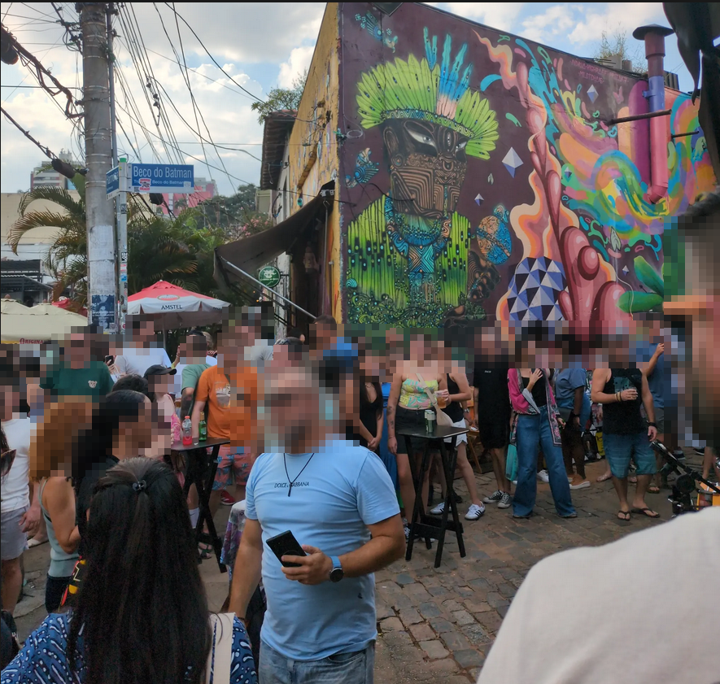

# Catch Me If You Can

In this challenge, we were provided with a picture of a street. Our objective is to find the name of the restaurant from the provided picture.

> *Figure 1: Street image used for identifying the location (Beco do Batman).

###Key findings
Identified the street name Beco do Batman. It is a street located in São Paulo's Vila Madalena neighborhood.

> *Figure 1: Street image used for identifying the location (Beco do Batman).

Looking further on google maps, there is a restaurant that serves hamburger nearby called "coringa do beco"

Type in the flag and done!
`THM{name_of_restaurant}`
