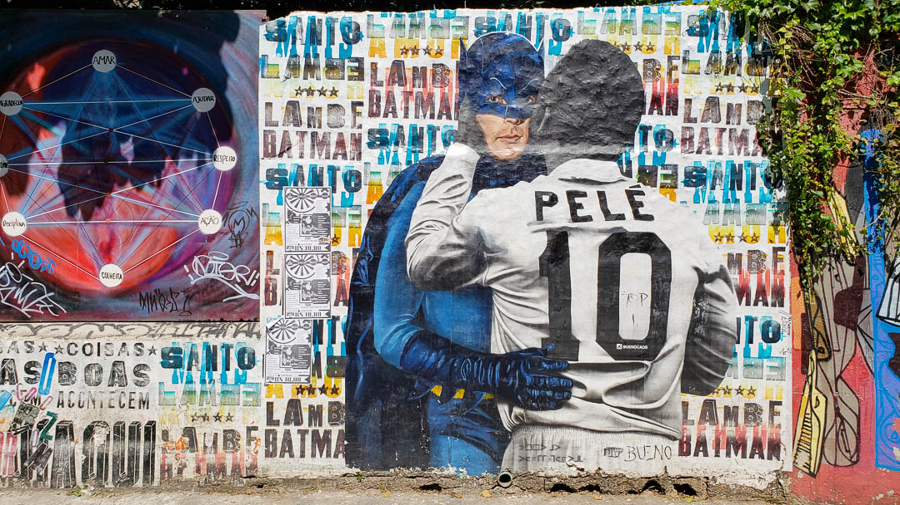
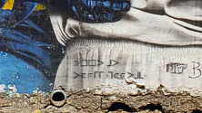
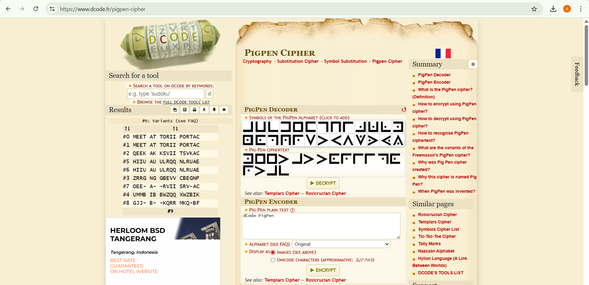
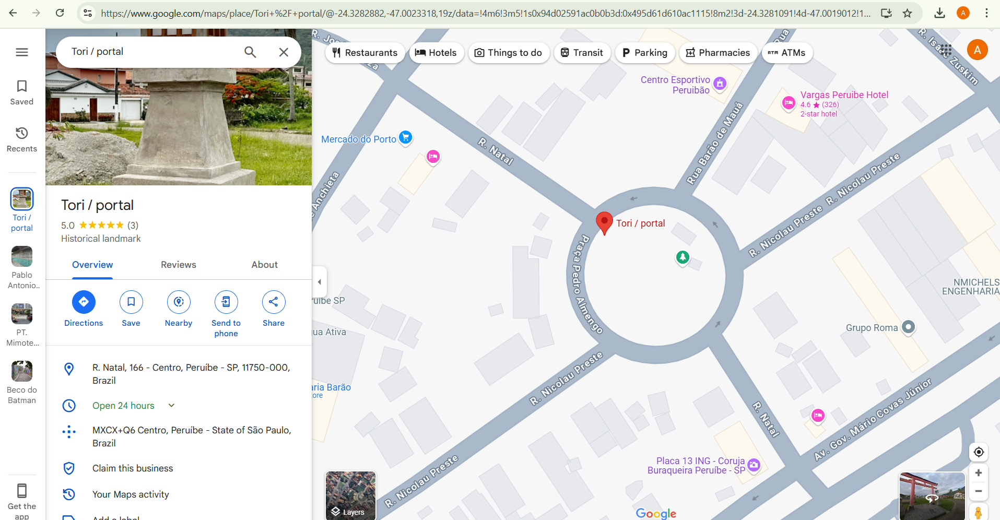

# Catch Me If You Can - Part 2

## Category
OSINT / Cryptography

## Tools Used
- Pigpen cipher decoder (online)
- Google Search / Maps

## Objective
Analyze a picture of graffiti art to find the hidden location. The flag is based on the identified place.

## Approach
- Closely inspected the image and found a **secret message** at the bottom of the graffiti.
- The hidden message was written using a **Pigpen Cipher**.

- Decoded the message using an online Pigpen cipher tool.  
- Identified the location as the **Tori Gate / Portal** located in **Centro Peruíbe, Brazil**.

## Flag Format
`THM{name_of_location}`

