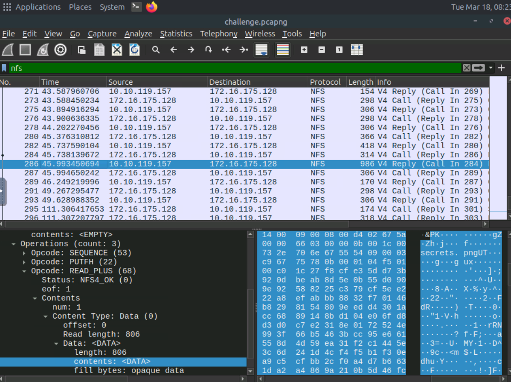
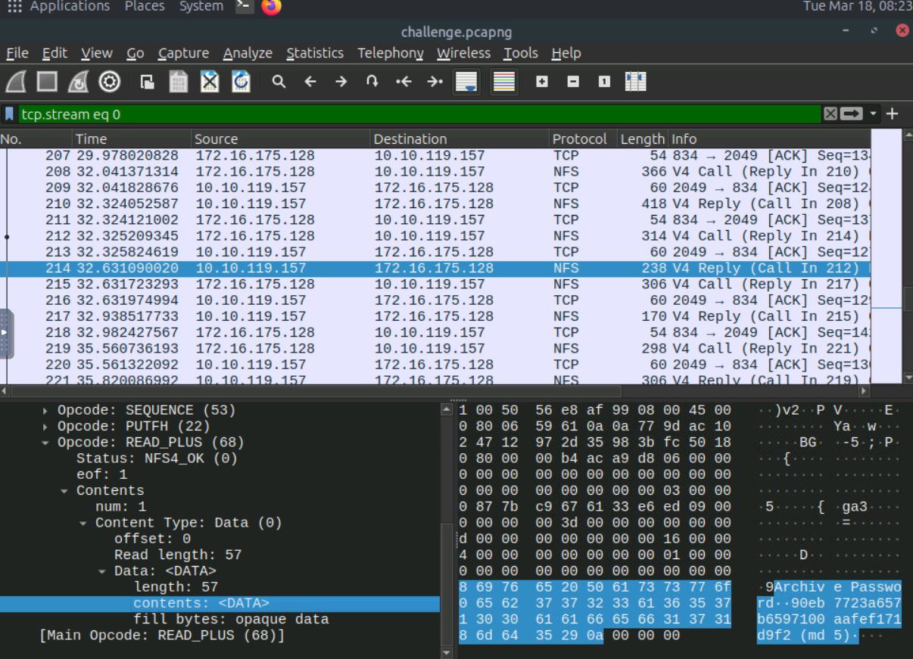
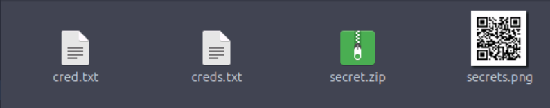
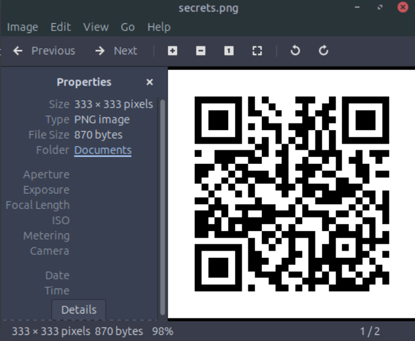
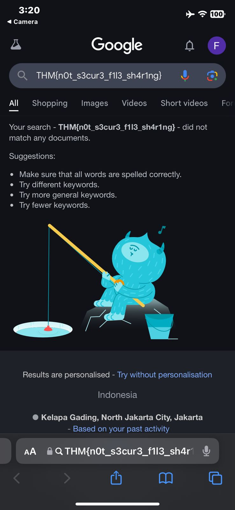

# Stolen Mount

## Category
Network Forensics / NFS / PCAP

## Objective
Given a PCAP file with NFS traffic, the task was to extract files or credentials and retrieve the final flag.

## Tools Used
- Wireshark
- Hash identifier and cracker (e.g., crackstation.net)
- Archive extraction tool
- QR code reader

## Approach
- Applied filters to focus on relevant **NFS streams** using Wireshark. Found a **ZIP archive** in stream 285 that required the password.

> *Figure 1: Stream containing secret.zip.*

After analyzing further we got the password on the pcap stream

> *Figure 2: Stream containing secret password.*

Now on to the next steps
- Decoded the MD5 hash to get the password.

> *Figure 2: Stream containing secret password.*

Extracted the archive to find a file containing a **QR code**. Lets scan it!

> *Figure 2: The Extracted Files.*

> *Figure 2: The QR code.*

The scan revealed the flag

